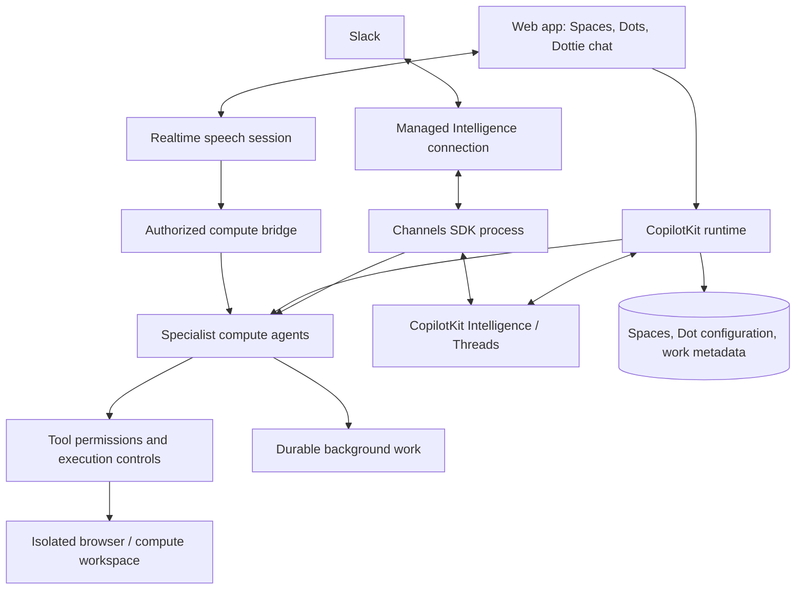

# OpenDots

### A little dot. A lot off your plate.

**An open-source work companion built on CopilotKit Intelligence, Threads, and Channels SDK.**

Organize your work into Spaces. Give Specialist Dots ongoing responsibilities. Pick up the conversation in text, on a call, or in Slack.

[Product](#the-product) · [Architecture](#architecture) · [Status](#development-status) · [Contributing](CONTRIBUTING.md)

---

OpenDots is inspired by [OpenAI Dots](https://help.openai.com/en/articles/20001530-getting-started-with-your-dot), with [OpenMuse](https://github.com/CopilotKit/OpenMuse) and [OpenBot](https://github.com/CopilotKit/openbot) as implementation references. It brings a persistent companion, specialist agents, conversations, and visible work into one interface.

> **Under development.** This README defines the product being built. The required CopilotKit integration and the features below are not yet a released, verified application. OpenDots is an independent implementation with its own branding and character.

## The product

### Spaces

A Space brings together related work: Specialist Dots, conversations, sources, and results. Move between Spaces without losing the context of the work or which Dot is responsible for it.

Space membership and tool access must be enforced on the server. A sidebar selection is not an authorization boundary.

### Specialist Dots

Give each Dot a name, role, instructions, and permitted tools. A researcher can investigate a topic; a writer can turn findings into a draft. Each Dot has a visible status, a durable conversation, and work you can inspect, pause, and resume.

Specialization changes the agent's instructions and capabilities, not just its avatar. Background responsibilities need a running worker and explicit execution controls.

### Dottie-style chat

The conversation is the main workspace:

- A companion avatar and status above the conversation.
- User messages in colored bubbles, with readable assistant replies and work updates.
- Contextual messages that link back to the page or artifact they came from.
- Text and call controls in the same conversation.
- Call receipts in the timeline, including duration and outcome.
- A nearby computer or result panel for inspecting the work.

**Text** runs through CopilotKit and persists in Intelligence Threads. Returning to the app should reopen the same conversation, including its tool activity.

**Call — RTS + Compute** pairs realtime speech with a separate compute agent. Speech keeps the conversation responsive while the compute agent performs longer work. The call and its resulting work belong to the same conversation. The exact voice service integration is being validated; a microphone icon alone does not constitute a working call.

### Slack through Channels SDK

Talk to a Dot from Slack using **`@copilotkit/channels`** and a managed CopilotKit Intelligence connection. The Channels SDK process runs the agent and its tools; Intelligence handles the provider connection and message delivery.

Slack identity must map to an authorized application identity and Space. A Slack conversation has its own stable thread; sharing it with a web conversation requires an explicit, authorized association. Display names or matching email addresses are not sufficient account linking.

## Required foundation

These are product requirements, not optional enhancements:

| Foundation                           | Responsibility                                               |
| ------------------------------------ | ------------------------------------------------------------ |
| **CopilotKit Intelligence**          | Durable agent infrastructure and managed channel connections |
| **CopilotKit Threads**               | Persisted conversations, messages, and agent activity        |
| **CopilotKit Channels SDK**          | Slack message handling and agent replies                     |
| **CopilotKit React SDK and runtime** | Web conversation UI, agent execution, and streaming          |
| **RTS + Compute**                    | Realtime calls connected to a separate compute agent         |

The application must report missing configuration explicitly. It must not silently substitute local chat storage or an unrelated model endpoint for Intelligence. Test fixtures may simulate dependencies; they are not a standalone product mode.

OpenDots application code is MIT licensed. CopilotKit Intelligence is required infrastructure: use a configured hosted project or a supported self-hosted deployment. Running OpenDots yourself does not remove that requirement. Model, speech, and hosted-service usage may incur separate costs.

## Architecture

Intelligence owns conversation history. The application stores Space and Dot configuration and background-work metadata. A job queue is not a replacement for Threads. Text, Slack, and speech must reach the same permission checks before an agent acts.

OpenMuse informs the persistent agent and visible-work experience. OpenBot informs agent-computer isolation and execution controls. Their application-specific channel concepts are distinct from the CopilotKit Channels SDK required here.

## Development status

A local research prototype has been built with persistent tasks, scheduling, memory controls, a separate read-only browser, and a responsive companion UI. It is being migrated to the required architecture before an application release.

| Capability                                      | Status                                                  |
| ----------------------------------------------- | ------------------------------------------------------- |
| Product scope and architecture                  | Defined in this README                                  |
| Persistent research tasks and browser isolation | Implemented in the local prototype; integration pending |
| Required Intelligence runtime and Threads       | Integration in progress                                 |
| Spaces and Specialist Dots                      | Planned implementation                                  |
| Dottie-style text conversation                  | Reference supplied; implementation pending              |
| Slack through Channels SDK                      | Integration pending                                     |
| Calls with RTS + Compute                        | Service contract and integration pending                |
| End-to-end connected-service verification       | Pending configured services                             |

This initial repository milestone is documentation. Application source, reproducible setup commands, and verified dependency versions will follow with the implementation. There is no production-ready deployment or hosted demo to sign up for yet.

### Implementation sequence

1. Require Intelligence and wire durable Threads into the web runtime.
2. Add persisted Spaces, Specialist Dot configuration, and server-side access checks.
3. Implement the Dottie conversation layout, text streaming, and contextual work panels.
4. Connect Slack through Channels SDK with explicit identity and Space mapping.
5. Add realtime calls, compute delegation, cancellation, and call receipts.
6. Verify background work, service failures, reconnects, and deployment setup.

## Contributing

Start with [Contributing](CONTRIBUTING.md). Keep changes focused on the required stack and the workflows above. Distinguish a working integration from a UI fixture, and include setup and verification evidence for new services.

Report security issues using [Security](SECURITY.md). Never include credentials or private conversation content in public issues.

## References

- [OpenAI: Getting started with your dot](https://help.openai.com/en/articles/20001530-getting-started-with-your-dot)
- [CopilotKit Intelligence](https://docs.copilotkit.ai/intelligence/overview)
- [CopilotKit Channels SDK](https://github.com/CopilotKit/channels-sdk)
- [Channels `createChannel` reference](https://docs.copilotkit.ai/reference/channels/functions/createChannel)
- [CopilotKit OpenMuse](https://github.com/CopilotKit/OpenMuse)
- [CopilotKit OpenBot](https://github.com/CopilotKit/openbot)

## License

[MIT](LICENSE).
