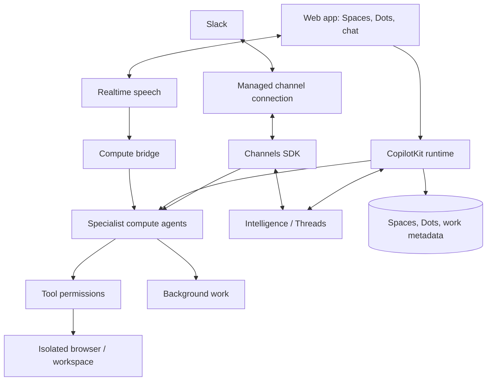

# OpenDots

### A little dot. A lot off your plate.

**An open-source template for persistent AI coworkers.**

Spaces, specialist agents, and conversations that move between text, calls, and Slack.

[Overview](#overview) · [Architecture](#architecture) · [Status](#development-status) · [Contributing](CONTRIBUTING.md)

---

## Overview

OpenDots is a starting point for building your own agent workspace. Clone it, define your Dots, connect your services, and adapt the interface and tools to your needs.

**A template, not a hosted product.** You run the application and configure its infrastructure. The template is under development; the status table below separates implemented work from planned integrations.

### Spaces

Group related Dots, conversations, sources, and results in a Space. Keep each area of work organized without losing the context of its conversations.

### Specialist Dots

Give each Dot a name, role, instructions, and permitted tools. A researcher can investigate a topic; a writer can turn findings into a draft. Inspect their work and control what they can do.

### Text and calls

A continuous conversation keeps the Dot's avatar and status above the messages, with text and call controls close at hand. Work updates, source links, and call receipts appear in the timeline; a side panel shows results or the agent's computer.

Calls pair realtime speech with a separate compute agent, so the conversation can continue while longer work runs. Both use the same conversation context and tool permissions. Voice integration is still in progress.

### Slack

Message a Dot through a managed Slack connection using Channels SDK. Explicit identity and Space mappings determine which conversations and tools a Slack user can access.

## Architecture

The template uses CopilotKit's React SDK and runtime, Intelligence for durable Threads, and Channels SDK for Slack. Application metadata and background-work state are stored separately from conversation history.

You configure the Intelligence project, model provider, and channel connection for your deployment; calls also need a speech provider. Credentials stay on the server. Missing configuration should produce a clear setup state, and test fixtures should remain visibly separate from live integrations.

[OpenMuse](https://github.com/CopilotKit/OpenMuse) and [OpenBot](https://github.com/CopilotKit/openbot) are code references for persistent work, agent computers, and execution controls. OpenDots can be adapted to your own workflows and deployment choices.

## Development status

A local research prototype includes persistent tasks, scheduling, memory controls, a separate read-only browser, and a responsive companion UI. That work is being integrated into the template's conversation architecture.

| Area                                              | Status                                                  |
| ------------------------------------------------- | ------------------------------------------------------- |
| Research tasks, scheduling, and browser isolation | Implemented in the local prototype; integration pending |
| Intelligence runtime and Threads                  | Integration in progress                                 |
| Spaces and Specialist Dots                        | Implementation in progress                              |
| Conversation layout and text streaming            | Implementation in progress                              |
| Slack                                             | Integration in progress                                 |
| Realtime calls and compute delegation             | Integration in progress                                 |
| Connected-service verification                    | Pending deployment configuration                        |

This initial repository milestone contains documentation. Application source and reproducible setup instructions will follow with the implementation.

### Next steps

- Finish conversation persistence and Space/Dot configuration.
- Connect text, Slack, and calls to the same authorized agent tools.
- Verify background execution, cancellation, reconnects, and service failures.
- Document local setup and container deployment.

## Contributing

See [Contributing](CONTRIBUTING.md) for development guidance and [Security](SECURITY.md) for reporting issues. Contributions should describe the workflow they enable, include verification evidence, and distinguish live integrations from fixtures.

## References

- [CopilotKit documentation](https://docs.copilotkit.ai/intelligence/overview)
- [Channels SDK](https://github.com/CopilotKit/channels-sdk)
- [OpenMuse](https://github.com/CopilotKit/OpenMuse)
- [OpenBot](https://github.com/CopilotKit/openbot)

## License

[MIT](LICENSE).
