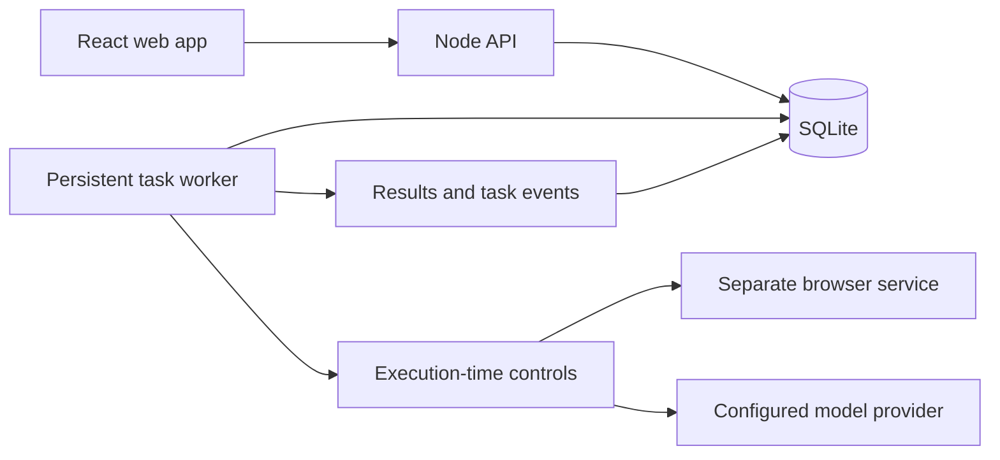

# OpenDots

### A little dot. A lot off your plate.

**An open-source work agent inspired by OpenAI Dots.**

Give your dot an ongoing responsibility. Follow its work, inspect its sources, and come back to the result.

[Get started](#get-started) · [Features](#features) · [How it works](#how-it-works) · [Roadmap](#roadmap) · [Contributing](CONTRIBUTING.md)

---

OpenDots brings a persistent agent, its workspace, and its activity into one interface. An original blue companion keeps you oriented while tasks run; conversations, research results, memories, and schedules stay available between visits.

The first release focuses on **ongoing research**: give your dot a page to investigate, review a sourced result, and schedule it to check again. The server keeps working when you close the browser.

> **Early development.** This repository is being built and verified. The feature list below defines the first-release scope; it is not yet a claim of a published, validated release. OpenDots is an independent project, not an OpenAI product or a complete reproduction of Dots.

## Why OpenDots?

- **Work that continues.** Tasks and schedules live on the server, beyond an open chat window.
- **Work you can inspect.** See task activity, source pages, results, and failures.
- **A companion you control.** Choose its name, manage its memories, and pause its work.
- **An application you can change.** Inspect the source, run your own deployment, and extend the adapters.

The architecture draws on [OpenMuse](https://github.com/CopilotKit/OpenMuse): durable tasks, a separate browser worker, visible activity, and rich results. OpenDots gives those patterns a focused research workflow and its own interface.

## Features

| Surface       | First-release scope                                                                              |
| ------------- | ------------------------------------------------------------------------------------------------ |
| Companion     | Original blue character, editable name, visible activity and pause state, reduced-motion support |
| Conversation  | Submit research tasks and inspect their persisted progress and results                           |
| Activity      | In-progress, scheduled, and completed work, with visible failures and retry controls             |
| Research      | Read a supplied public URL and synthesize a result with source links                             |
| Agent browser | Separate read-only browser service with page capture and bounded navigation                      |
| Schedules     | Recurring checks that run while the application server is running                                |
| Memory        | Inspect and manage saved context; control whether research uses it                               |
| Controls      | Pause the agent, cancel tasks, and enforce supported research permissions on the server          |
| Sample mode   | Clearly labeled fictional sources for trying the workflow without a model key                    |

### Two explicit modes

**Sample mode** lets you explore task creation, activity, persistence, scheduling, and controls without paid services. Its research content is fictional and labeled as such.

**Live mode** uses the separate browser service and a configured OpenAI-compatible model endpoint. The initial live workflow requires a public URL; general web search is not included. Provider and browser failures appear as failed tasks, not sample results.

## Get started

Setup instructions will be finalized after the initial implementation passes its acceptance checks. The planned development environment is **Node.js 24**, **npm**, and a modern browser. Sample mode will not require a model key or Docker.

The live browser service will have a Docker Compose configuration. Live model usage is billed by your configured provider. Recurring work requires the application server to remain running; closing its browser tab is supported, shutting down the server is not continuous execution.

## How it works

The database stores task state, schedules, messages, and settings. The worker claims due work, records progress, and persists results. The UI reads that state, so a page refresh does not restart the work. Browser access and model credentials stay behind the server boundary.

OpenDots is initially a **single-owner application**. Local development binds to loopback. Public deployments require authentication, HTTPS, and an isolated browser service. See [Security](SECURITY.md) for the deployment boundary and reporting process.

## Roadmap

The first milestone is a verified research workflow with durable scheduling and an inspectable browser. Further milestones are:

- Search-provider integrations for research without a supplied URL.
- Slack and other messaging channels.
- Connected-app adapters with explicit permission scopes.
- File attachments and additional artifact viewers.
- Voice and optional desktop integration.
- Additional model-provider adapters and deployment options.

These are planned capabilities, not working integrations in the first release. OpenDots does not currently offer local-computer control, arbitrary shell execution, payments, or autonomous outbound messaging.

## Contributing

Issues and pull requests are welcome. Start with [Contributing](CONTRIBUTING.md), explain the workflow you want to improve, and include a reproducible example for bugs. Report security issues through the process in [SECURITY.md](SECURITY.md).

## Acknowledgments

- [OpenAI Dots](https://help.openai.com/en/articles/20001530-getting-started-with-your-dot) provides the product inspiration.
- [CopilotKit OpenMuse](https://github.com/CopilotKit/OpenMuse) provides the architectural reference.

OpenDots has its own branding and character. References to other products describe inspiration and do not imply affiliation or endorsement.

## License

[MIT](LICENSE).
